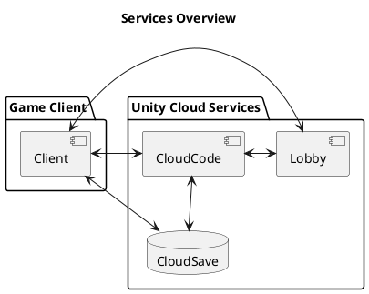
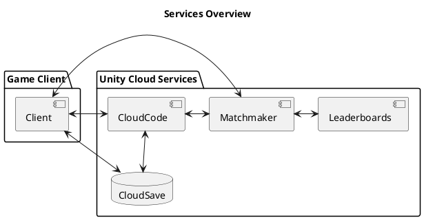
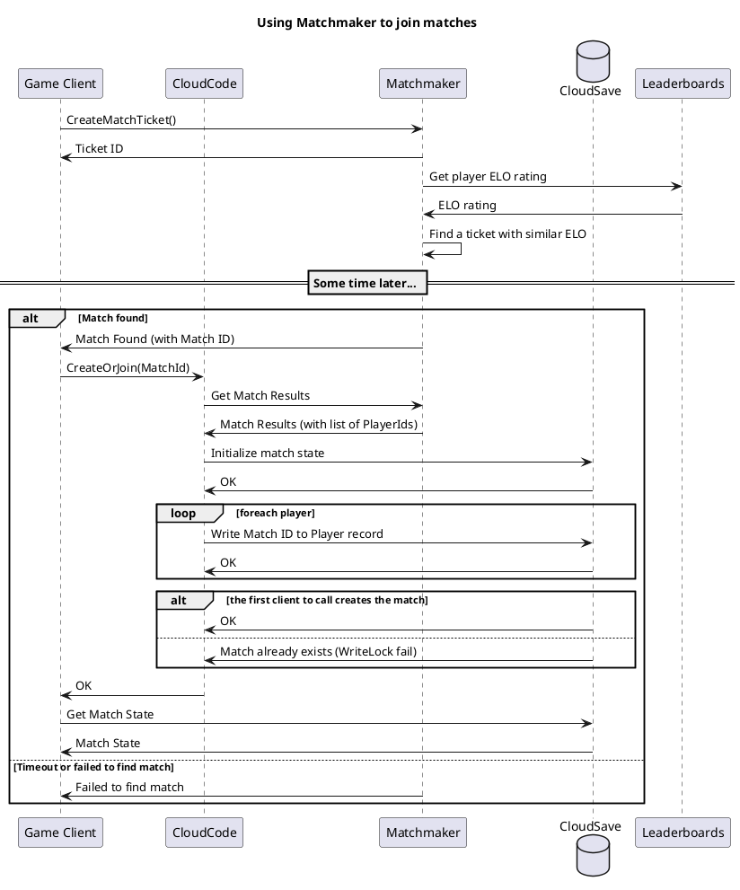
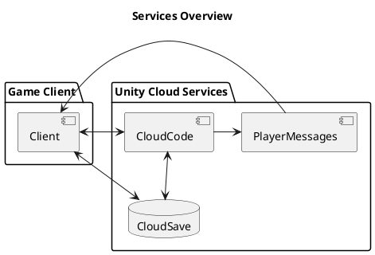
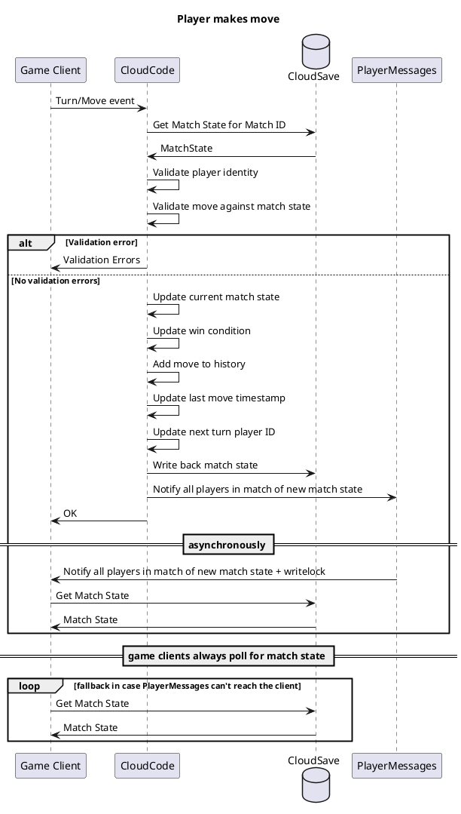
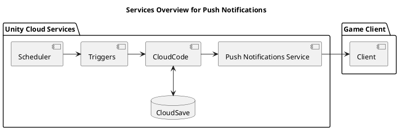
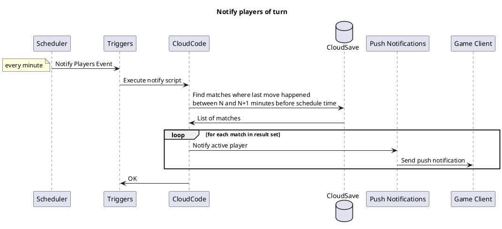

# Multiplayer Chess Sample

A sample project that demonstrates how to implement a server authoritative asynchronous multiplayer game using [Unity Gaming Services](https://unity.com/solutions/gaming-services), without needing a dedicated game server.
The game utilizes a wide range of UGS products and services to implement the following multiplayer features:

- Server authoritative turn processing
- Automatic synchronization of game state for clients
- ELO leaderboard
- Private matches using join codes
- Public matchmaking based on player ELO ratings
- Push notifications to inactive players
- **_TODO: player login to show multi-device play?_**

## Setup

To run the chess sample, import the Chess folder as a Unity project, open and run the `ChessDemo.unity` scene.

For this sample to work, you first need to publish your Cloud Code Module and Leaderboard via the Deployment Window.

To access the Deployment window:
- In 2021 or before, use `Window > Deployment`.
- In 2022 and later, use `Services > Deployment`.

Then click on `Deploy All` to deploy both `ChessCloudCode.ccmr` and `EloRatings.lb`. See [Deployment Window](https://docs.unity.cn/Packages/com.unity.services.deployment@1.0/manual/deployment_window.html) for more information.

To run another game client locally to play against, go to `File -> Build and Run`. Then you can create a game in one client, and join it in the other using the generated code shown in the top right of the game window.

To limit access to specific Cloud Code endpoints from authenticated players (i.e. the game client), have a look at the [Access Control](https://docs.unity.com/ugs-overview/en/manual/access-control) documentation.

### .NET Requirement

To deploy Cloud Code Modules in the editor you must first install .NET.

Follow the steps below to set your default .NET path in editor:

1. In the Unity Editor, select `Edit > Preferences… > Cloud Code`.
2. In the .`NET development environment` section, modify your `.NET path` to the one you have it installed.
3. Select `Apply`.

### Alternative Setup

Alternatively to using the Deployment Window, you can publish your Cloud Code module and Leaderboard via the UGS CLI. Remember to [install and configure](https://services.docs.unity.com/guides/ugs-cli/latest/general/get-started/install-the-cli/) the CLI first. This requires a project ID, environment name and a service account key, all of which can be created and found in the [Unity Dashboard](https://dashboard.unity.com).

Once the CLI is set up, the module and leaderboard can be deployed with the following commands (or by running the `deploy.sh` script):

```
ugs deploy ChessCloudCode/ChessCloudCode.sln --services cloud-code-modules
ugs deploy Chess/Assets/Setup/EloRatings.lb --services leaderboards
```

## How it works

### Starting a match using join codes



### Starting a match through matchmaking

Public matches can be arranged via Matchmaker. Each client contacts Matchmaker and joins the matchmaking queue by creating a ticket. The Matchmaker service retrieves the player's ELO rating from Leaderboards, and proceeds to find another ticket with a comparable rating according to the queue configuration.

Once a ticket pair is established, Matchmaker creates a unique match ID and returns it to both clients. Both clients execute a Cloud Code function that attempts to join that match, or if it's not yet available, create it. The clients enter an intentional race condition, where the first execution will initialize the match state and the second one will simply recieve a conflict error.

The game state is written to a Cloud Save protected custom data record with the starting configuration of the board. Such records can be read directly by game clients, but can only be updated by a server authoritative system such as Cloud Code. The match state record contains:

- The state of the game board
- Whether one of the players has won the game
- The IDs of both players
- Whose turn is next
- The timestamp of the last move
- A history of all previous moves

The active match ID is also written to both player's Cloud Save Data records, so that they can automatically rejoin the match whenever the game is run.

No matter the result of their Cloud Code initialization call, both clients fetch the game state from Cloud Save and enter the match. The appropriate player is then responsible for making the first move.




### Making a move

Game clients cannot be trusted to update the game state directly, as malicious players could to subvert the game by using a modified game build. In order to make a move, the game client runs a Cloud Code function that is responsible for updating the game state appropriately. Only Cloud Code is ever allowed to modify the game

The function loads the match state from Cloud Save and validates that the player is indeed the one supposed to move next and that the move is legal. It then derives the updated game state and writes it back to the Cloud Save record, updating the move history and last move timestamp as well.

Once state has been updated, the game clients need to be notified of the change. The game clients register a callback for Player Messages on startup, so that they can be contacted by the backend when state changes. The callback is responsible for retrieving the latest state and updating the game display appropriately. As a fallback for the server-to-client notification mechanism, the clients automatically retrieve the latest state every so often. This guarantees the game interface will react to the other player's moves.






### Sending Push Notifications

In games with potentially long turnaround times (as can be the case with chess), the players are likely to close their game client after submitting their move. Once they do they can no longer be notified of game state updates. We need a fallback mechanism to inform them that the other player has moved and they need to open the client again and react. A system-level push notification can be a good way of achieving this.

We can use Scheduler and Triggers to periodically execute a Cloud Code function that generates the appropriate notifications to the clients. Every event Scheduler produces corresponds to a time window the Cloud Code function is reponsible for processing.

Using the Cloud Save Queries feature, we can index the last move timestamp stored in the match state record. The Cloud Code function can then query the system for all matches where the last move happened within it's time window of responsibility. For example, let's assume that after 10 minutes without moving we consider the player has closed their game client and needs to be notified. Let's also say that Scheduler produces an event every minute that will triggers the notification function. Every time the function runs, we can query Cloud Save for all matches where the last move happened between 10 and 11 minutes ago. Once we obtain the list of matches, we can generate notifications for all the players in them. Upon recieving the notification, the player can start their game and retrieve the updated game state.

If we include the time window lookback as a payload parameter of the Scheduled event, multiple instances can be set up to create repeat notification windows. For example, we can set up events for notifications after 10 minutes, one hour, 3 hours and 12 hours from the last move.





## Credits

This project uses the [Free Low Poly Chess Set](https://assetstore.unity.com/packages/3d/props/free-low-poly-chess-set-116856) asset for the board and chess pieces, and the [Gera Chess Library](https://github.com/Geras1mleo/Chess) for validating the moves made by players.

See [Third Party Notices](Third%20Party%20Notices.md) for more information.
